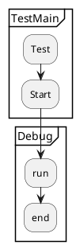

# Kroki


<!--more-->
# Kroki
1. java11
2. [kroki](https://github.com/hnboy/kroki/releases/download/v.10/kroki-standalone-server-v0.23.0.jar)
3. [plantuml](https://github.com/hnboy/kroki/releases/download/v.10/plantuml)
4. [wavedrom](https://github.com/hnboy/kroki/releases/download/v.10/wavedrom)

# 功能介绍
- 使用它在 AsciiDoc、Markdown、reStructuredText 和 Textile 文档中创建图表。

# Demo
- 使用案例
[Demo](https://kroki.io/examples.html)





```c++
[wavedrom, 1, svg]
....
{ signal : [
  { name: "clk",  wave: "p......." },
  { name: "bus",  wave: "x.3456..",   data: "head body tail data" },
  { name: "wire", wave: "0.1...x." },
]}
....
```


```c++
[plantuml, 1, svg]
....
@startmindmap
skinparam monochrome true
+ OS
++ Ubuntu
+++ Linux Mint
+++ Kubuntu
+++ Lubuntu
+++ KDE Neon
++ LMDE
++ SolydXK
++ SteamOS
++ Raspbian
-- Windows 95
-- Windows 98
-- Windows NT
--- Windows 8
--- Windows 10
@endmindmap
....
```


